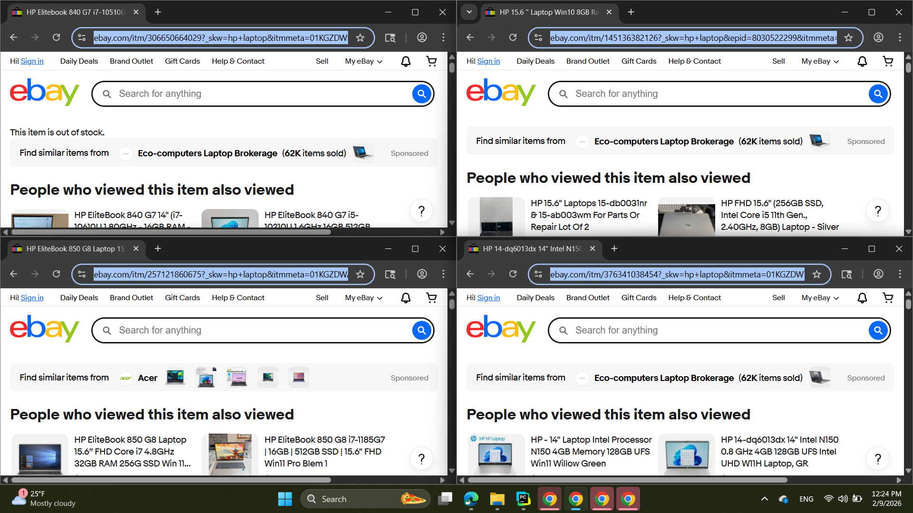

# 🛒 eBay Scraper & Listing Enricher

A two-stage **Python eBay scraping project** built with **SeleniumBase**
and **BeautifulSoup**.

This project: 1. Searches eBay for a keyword 2. Collects listing data 3.
Opens each listing page 4. Extracts the full item description 5. Saves
clean, structured JSON output

Designed for **learning, research, and personal automation**.

------------------------------------------------------------------------

## 📁 Project Structure

    .
    ├── part1.py        # Search eBay & collect listing data
    ├── part2.py        # Visit listings & extract descriptions
    ├── config.py       # Search configuration
    ├── JSON/
    │   ├── data.json               # Output from part1
    │   └── hp_laptop_eBay.json     # Final enriched output

------------------------------------------------------------------------

## ⚙️ Configuration

Edit `config.py`:

``` python
SEARCH_WORD = "hp laptop"
MAX_ITEMS = 100
```

------------------------------------------------------------------------

## 🚀 Usage

### Step 1 --- Collect Listings

``` bash
python part1.py
```

Output:

    JSON/data.json

------------------------------------------------------------------------

### Step 2 --- Enrich Listings

``` bash
python part2.py
```

Output:

    JSON/hp_laptop_eBay.json

------------------------------------------------------------------------

## 🧠 Features

-   SeleniumBase (undetected mode)
-   iframe & modern layout support
-   Duplicate listing protection
-   Rate-limited scraping
-   Clean JSON output

------------------------------------------------------------------------

## 🛠 Requirements

-   Python 3.9+
-   SeleniumBase
-   BeautifulSoup4

``` bash
pip install seleniumbase beautifulsoup4
```

------------------------------------------------------------------------

## ⚠️ Disclaimer

For educational and personal use only.\
Scraping eBay may be subject to their Terms of Service.

------------------------------------------------------------------------
## 📸 Screenshots

### eBay Search Results


### Part 1 Output (data.json)


### Final Enriched Output


